# open.mp Launcher — macOS (Apple Silicon)

[](https://github.com/Mac-Andreas/omp-launcher-macOS/releases/latest)
[](https://github.com/Mac-Andreas/omp-launcher-macOS/stargazers)

A native **macOS (Apple Silicon)** build of the
[open.mp launcher](https://github.com/openmultiplayer/launcher). Upstream is
Windows-only; this fork adds the bits needed to build, sign, and run it on a
Mac.

---

## What you need

| Thing | Why |
|---|---|
| **Mac with Apple Silicon** (M1/M2/M3/M4) | Intel Macs are not supported. |
| **[CrossOver](https://www.codeweavers.com/crossover)** | Runs the Windows version of GTA: San Andreas on macOS. |
| **GTA: San Andreas v1.0** in a CrossOver bottle | SA-MP / open.mp only work with the **1.0** executable — Steam / Rockstar Launcher copies must be downgraded. |

The launcher cannot install the game or Windows for you — set the two above up
once, then the launcher handles everything else automatically.

---

## Screenshots

### Server browser

| Favorites | Internet | Partners |
|---|---|---|
| 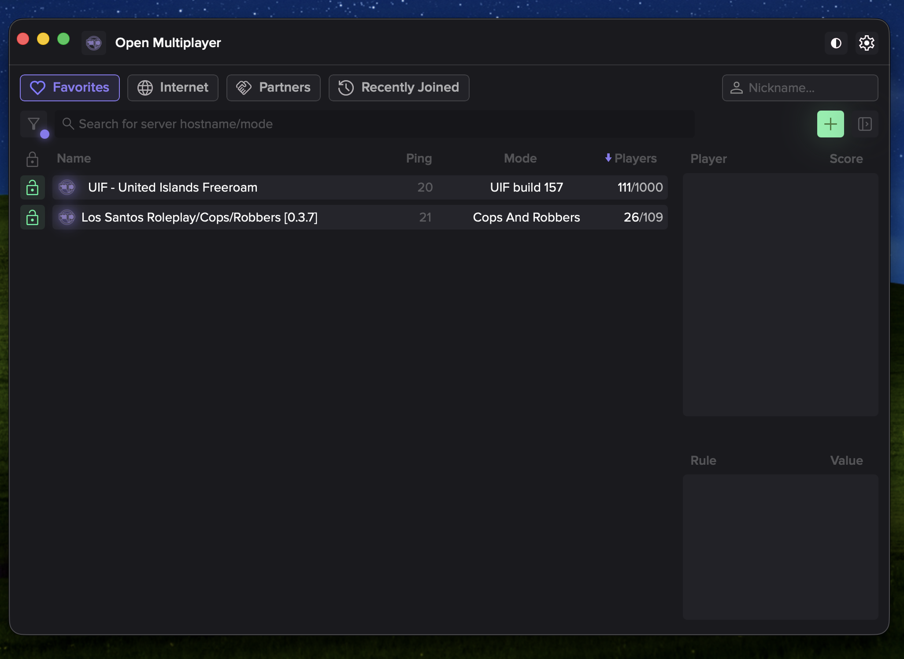 | 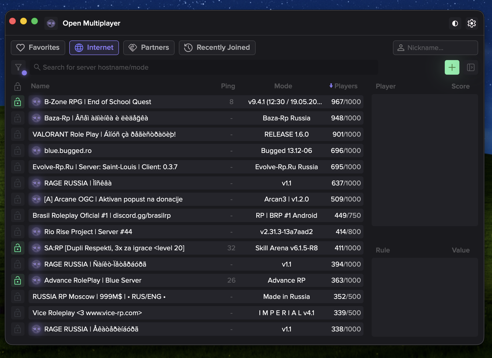 | 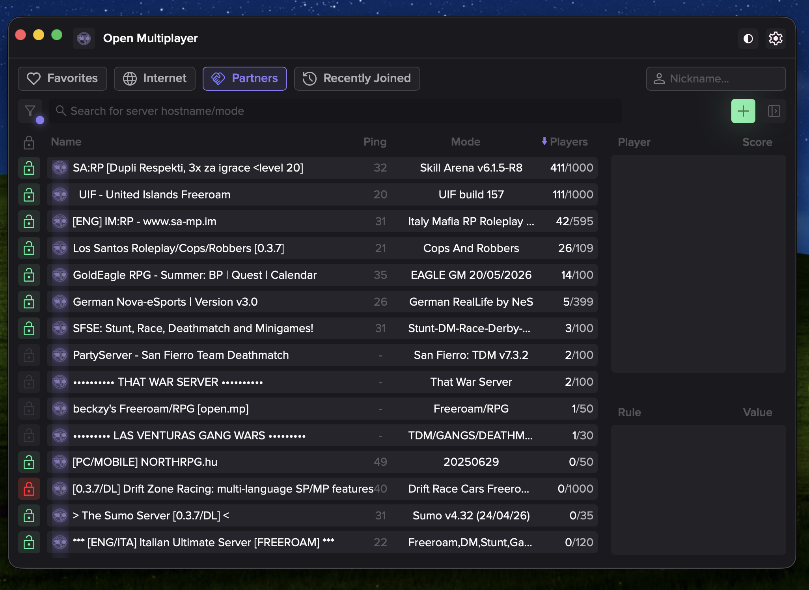 |

### Settings

| Overview | Installing SA-MP |
|---|---|
| 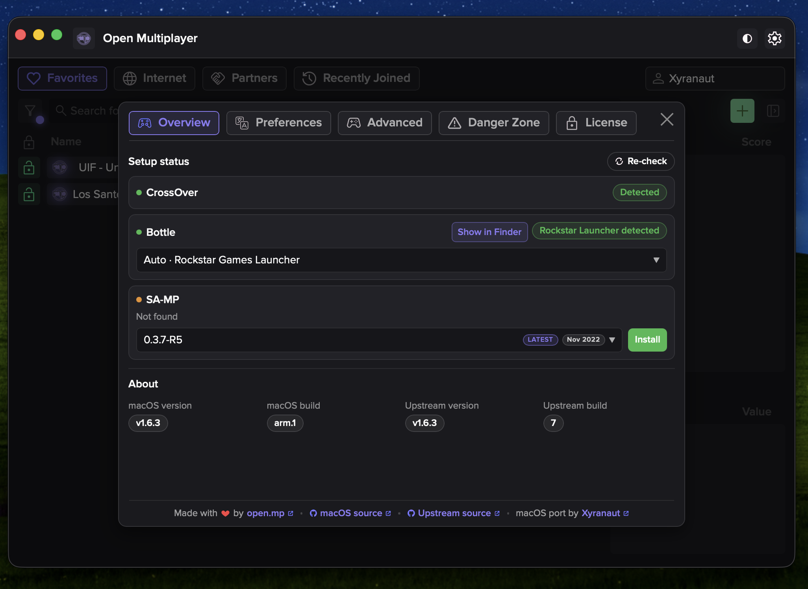 | 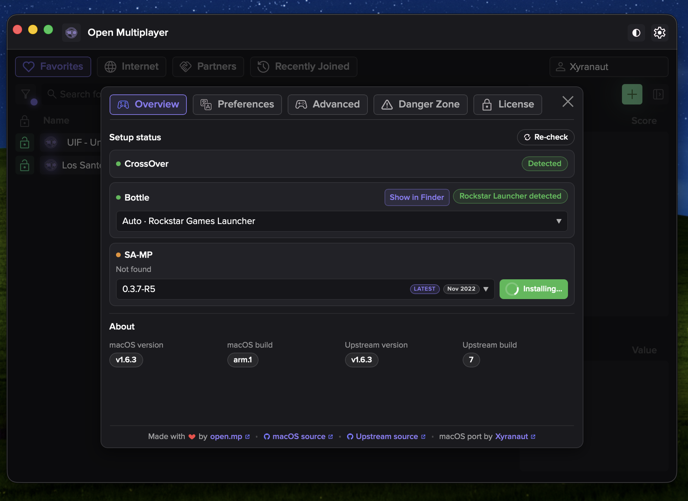 |

| Preferences | Advanced |
|---|---|
| 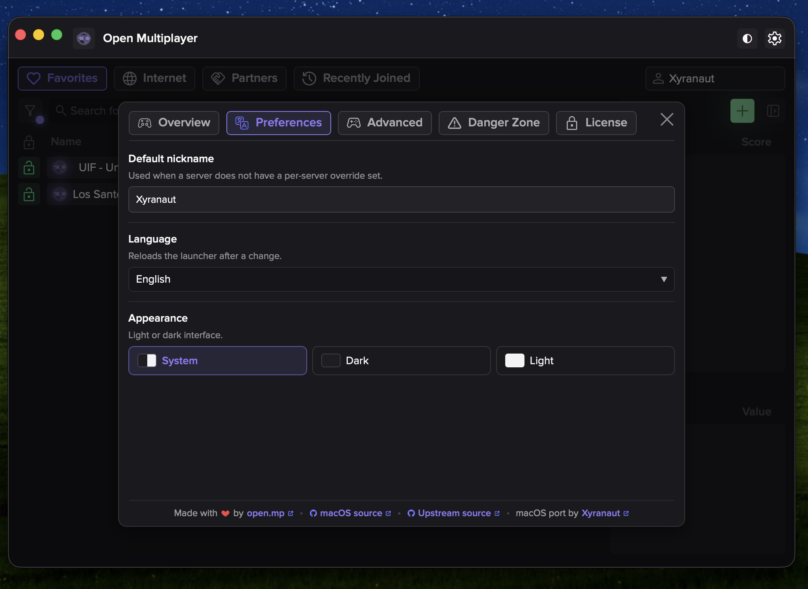 | 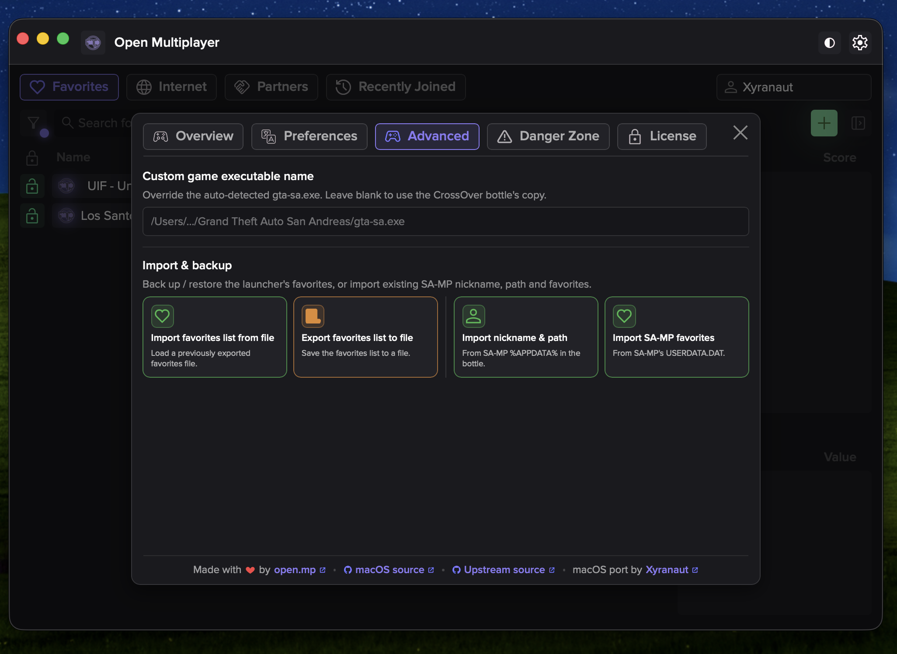 |

| Danger Zone | Danger Zone — SA-MP installed |
|---|---|
| 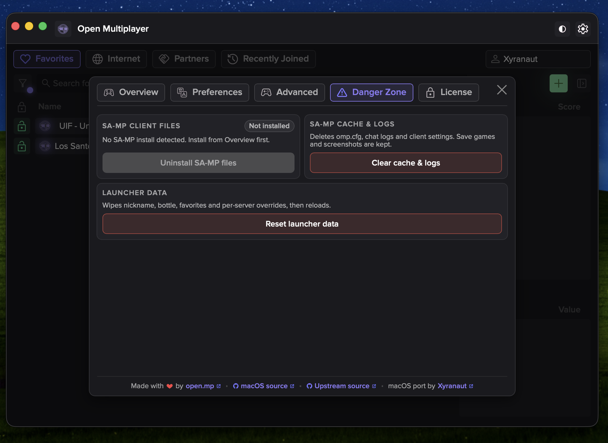 | 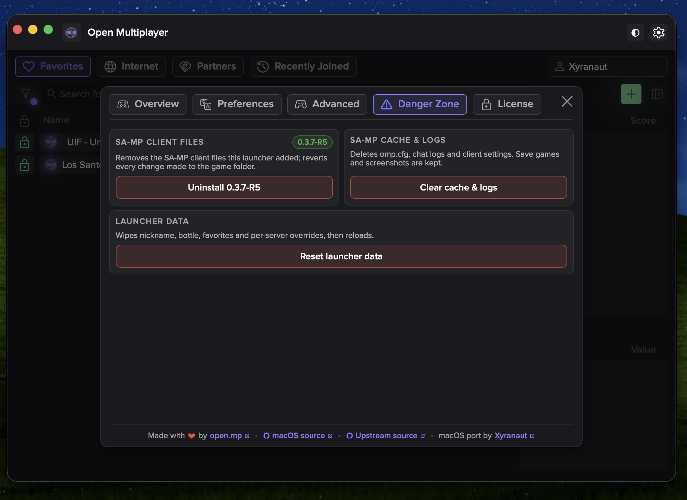 |

| License |
|---|
| 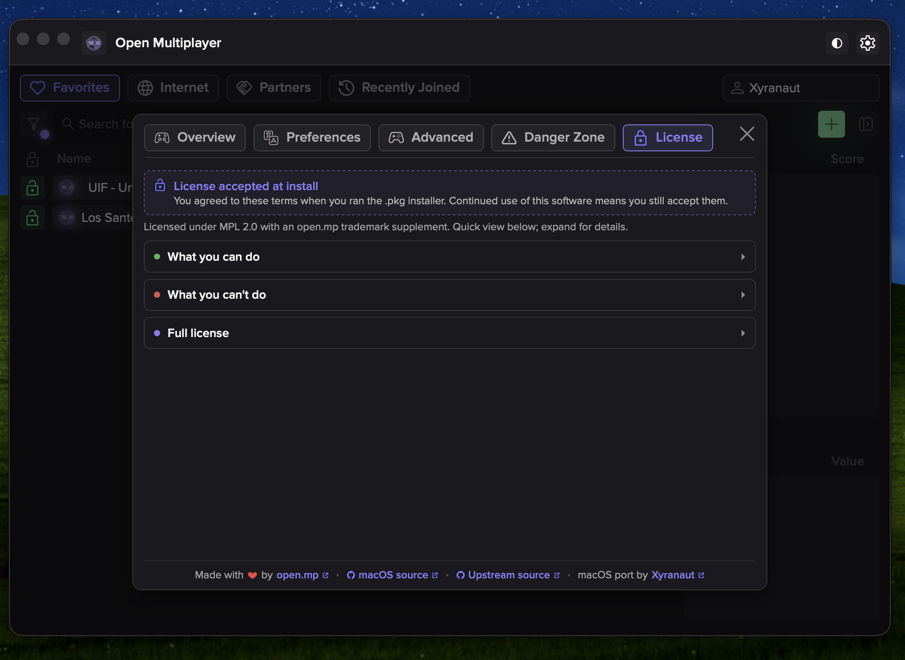 |

---

## Install

1. Download `omp-launcher_*_aarch64.pkg` from
   [Releases](https://github.com/Mac-Andreas/omp-launcher-macOS/releases/latest).
2. Double-click the .pkg. Accept the license, click through, enter your
   password when prompted.
3. Open **omp-launcher** from Applications.

The installer's postinstall step clears `com.apple.quarantine` and re-applies
the ad-hoc signature on the installed app, so the bundle launches without the
macOS "damaged" warning — no Terminal steps required after install.

### If macOS blocks the .pkg on first run

This is a free, unofficial build with no paid Apple Developer account, so the
`.pkg` itself isn't notarised. On a fresh Mac, Gatekeeper may refuse to open
it on double-click and show a *"could not be verified... was blocked to
protect your Mac"* dialog. This is expected, not a sign of anything being
wrong with the file.

To allow it through (one-time, per download):

1. Open **System Settings → Privacy & Security**.
2. Scroll down to the **Security** section.
3. Next to the `omp-launcher_*_aarch64.pkg` line, click **Open Anyway**.
4. Confirm with your password / Touch ID.
5. Re-run the `.pkg` — it will now launch normally.

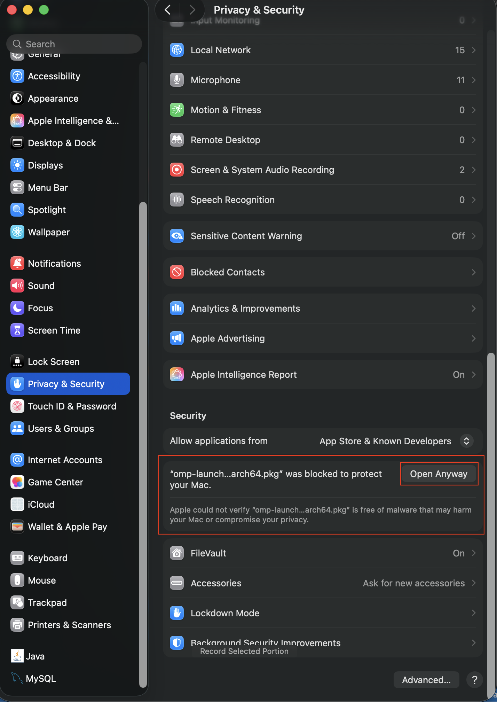

After install, the launcher itself opens without further Gatekeeper prompts;
the postinstall step takes care of that.

---

## Updates

The launcher checks **this repo's GitHub releases** for updates, not the
upstream Windows channel. Versions are tagged `1.6.3-arm.N` — a Windows
release like `1.6.4` will **not** prompt this build to update. Only when a new
`-arm` tag ships here does the "Update available" badge appear.

| Tag pattern | Source | Triggers update prompt? |
|---|---|---|
| `1.6.3-arm.N` | This fork | Yes |
| `1.6.4` | Upstream Windows | No |

---

## Building from source

Requirements:
[Rust nightly](https://rust-lang.github.io/rustup/concepts/channels.html),
[Node.js](https://nodejs.org) (not v20.6), Xcode command-line tools.

```bash
git clone https://github.com/Mac-Andreas/omp-launcher-macOS
cd omp-launcher-macOS
yarn
./scripts/build-macos.sh
```

`build-macos.sh` compiles, ad-hoc signs, and writes
`omp-launcher_<version>_aarch64.pkg` to the repo root.

Development: `yarn start`.

---

## Credit

All launcher functionality is the work of the
[open.mp team](https://github.com/openmultiplayer/launcher). This fork only
adds the macOS build path. Support upstream:
<https://opencollective.com/openmultiplayer>

---

## Legal & disclaimer

- **You must own a legitimate copy of GTA: San Andreas.** This project does
  not distribute, link to, or assist in obtaining the game, its assets, or
  any Rockstar / Take-Two property. Use a copy you have lawfully purchased
  (Steam, Rockstar Games Launcher, retail disc, etc.).
- **No piracy.** This project does not endorse, condone, or support
  pirated copies of GTA: San Andreas, SA-MP, open.mp, CrossOver, Windows,
  or any other software. Requests for pirated material will not be
  entertained in issues, discussions, or any other channel.
- **Not affiliated.** This is an unofficial, community-built fork. It is
  not affiliated with, endorsed by, or sponsored by Rockstar Games,
  Take-Two Interactive, CodeWeavers (CrossOver), the SA-MP team, the
  open.mp team, or Apple. All trademarks and product names are the
  property of their respective owners.
- **Third-party tools used at your own risk.** Any external tools or
  procedures referenced in community guides (bottle setup, downgraders,
  patchers, etc.) are not part of this project. Use them at your own
  discretion and on copies you own.
- **No warranty.** The launcher is provided "as is", without warranty of
  any kind, express or implied. You are responsible for backups and for
  any consequences of running the software on your machine.
- **License.** Source code is distributed under the
  [Mozilla Public License 2.0](https://www.mozilla.org/en-US/MPL/2.0/),
  inherited from upstream. The "open.mp" name and logo remain subject to
  upstream's trademark policy.
